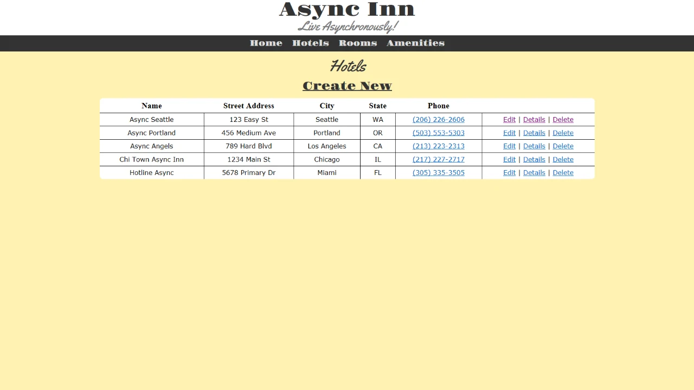

# AsyncInn
**Author**: Benjamin Taylor  
**Version**: 1.0.0

## Overview
A ASP.NET web application designed to simulate a hotel inventory system.

## Getting Started
1. Create a fork of this repository, and clone your fork to your device.
2. Open the solution file `AsyncInn` in Visual Studio.
3. To run the app, go to `Debug` > `Start Without Debugging` (or press Ctrl+f5).

## Using The Application

1. Upon starting the application, you will be directed to the home page, seen above.

## Architecture
**Languages Used**:
* C# 7.3 (ASP.NET Core 2.2)

Written with Visual Studio Community 2019.

## Acknowledgements
- **Eric Meyer** - Reset CSS ([MeyerWeb](https://meyerweb.com/eric/tools/css/reset/))
- **Google Fonts** - Yellowtail and Gravitas One Fonts ([Google Fonts](https://fonts.google.com/))

## Change Log
- **04-04-2019 9:37PM** - Initial Version